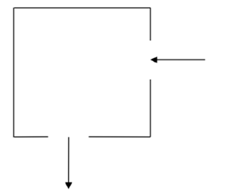

## CFD_accelarated

During a workshop on GPU programming, I came across a serial code that was offered in three different programming languages: Fortran, C++, and Python. I took the initiative to modify the code to run on GPU and explored four different parallel running techniques: concurrency using the standard programming language, the cuda library, OpenAcc directives, and OpenMP directives.

### Description
This code is a Simple 2D regular-grid Computational Fluid Dynamics(CFD) simulation for teaching GPU programming using multiple approaches. This is a simple simulation of an incompressible fluid flowing in a cavity using the 2D Navier-Stokes equation. The fluid flow can either be viscous (finite Reynolds number and vortices in the flow) on non-viscous (no Reynolds number specified and no vortices in the flow).

It is deliberately written to be very simple and easy to understand so it can be used as a teaching example.

In this exercise the finite difference approach is used to determine the flow pattern of a fluid in a cavity. For simplicity, the liquid is assumed to have zero viscosity which implies that there can be no vortices (i.e. no whirlpools) in the flow. The cavity is a square box with an inlet on one side and an outlet on another as shown below

